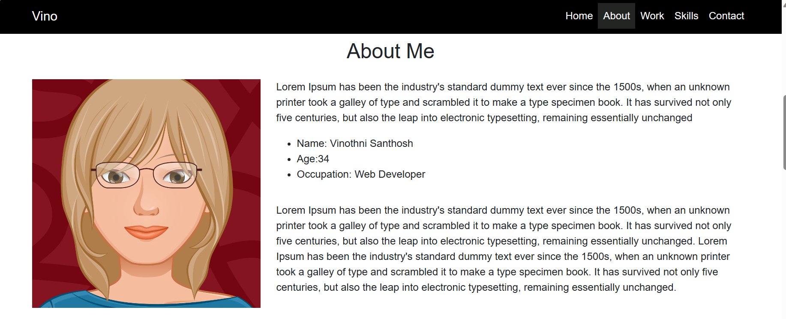
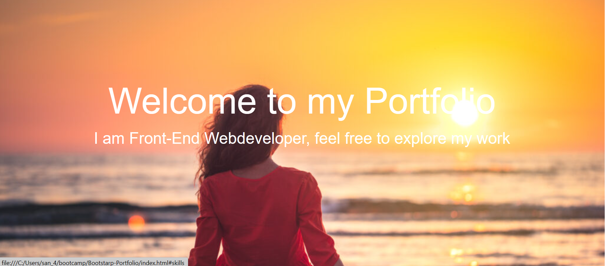
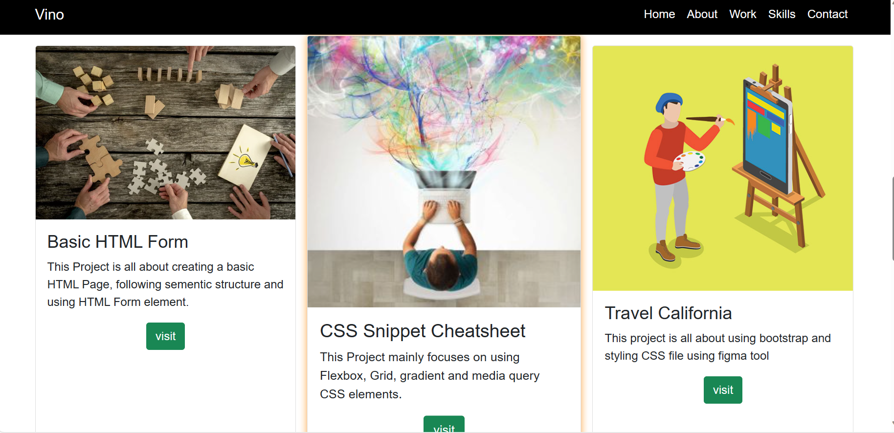
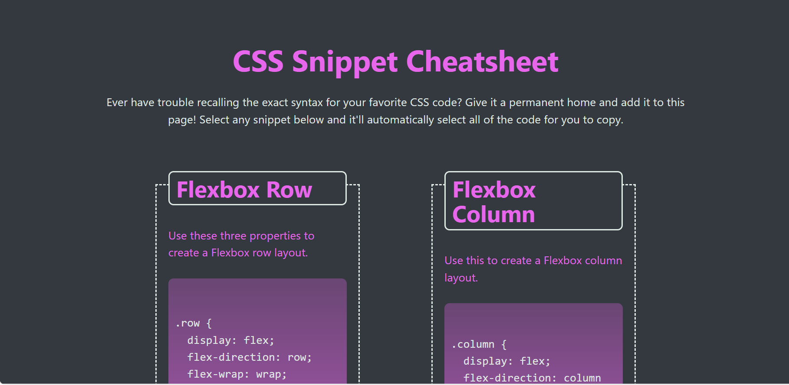
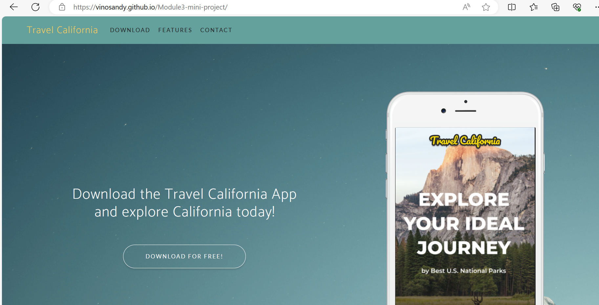
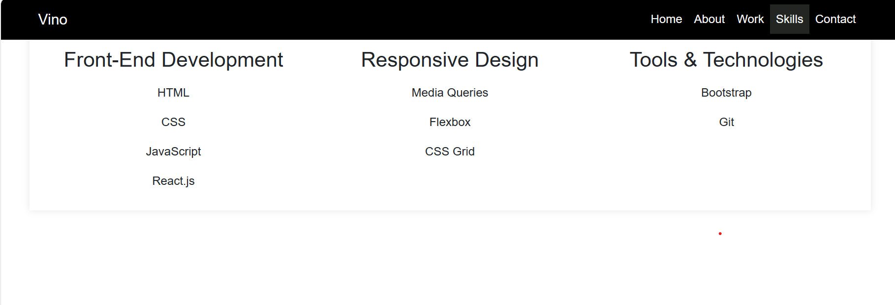
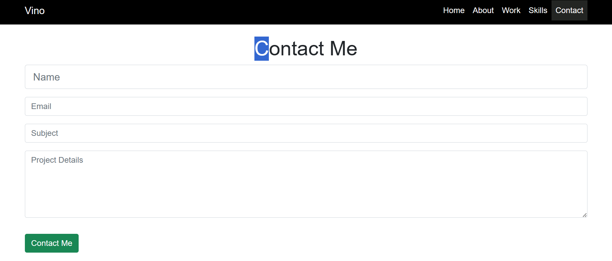

# Bootstarp-Portfolio
## Description:
   Bootstrap-portfolio is about portfolio built using HTML, CSS and Bootstrap.
## Contents:
   The Portfolio has following sections,
    * Navigation bar.
    * Home.
    * About.
    * Hero section.
    * Work.
    * Skills.
    * Contact.
    * Footer.

 ### Navigation Bar:
     The navigation bar contains content Links of the portfolio and helps the user to navigate to the respective content of the page. All the links gets highlited when the user hover over the links.

     

 ### About:
     On selecting about section, the user gets navigated to the About Me content of the page.
     To create this section Row and nested column classes has been used.
     

 ### Hero section:
     It is a banner section of the web page.
     To create this section jumbotron class has been used.
         

 ### Work:
    On selecting Work in the navigation bar, the user gets navigated to the work content of the page.
    The work section has details about the miniprojects completed in class after each module.
    When the user hover over the projects get highlighted.
    To create this section Containers,column and card classes has been used.
          

     Project 1:

     Its about creating basic HTML page with header,body, footer and using Form HTML element
     

    Project 2:
     Its about using FLEX, GRID, Media queries and styling CSS page using gradient,shadow and transition property.
     

     Project 3:
     Its about using bootstrap and figma in creating a responsive web page.
     

   ### Skills:
      This section describes about the Skill set of the developer.
      

   ### Contact:
      This section describes how to contact the developer using Email.
      To create this section, Form class is used from the bootstrap.
      

   ### Footer:   
       This section helps the user to connect via social media platform.
       This section gets highlighted when user hover over them.
       
       .

 ## Resources used:
   * [Bootstrap Documentation](https://getbootstrap.com/docs/5.3/getting-started/introduction/)

   * [Responsive Web Design - How to Create Media Queries](https://www.youtube.com/watch?v=5xzaGSYd7jM)

   * [Media Queries 101 by CSS Tricks](https://css-tricks.com/css-media-queries/)

   * [Media Query Documentation](https://www.w3schools.com/css/css_rwd_mediaqueries.asp)

   * [Github Pages Guide](https://pages.github.com/).

  ## GitHub URL:
    # My GitHub URL: 
      https://github.com/VinoSandy/Bootstarp-Portfolio.git

    # Deployed Application URL:
      https://vinosandy.github.io/Bootstarp-Portfolio/

    # Previous application URL:
      https://vinosandy.github.io/script-craft/
      
      https://github.com/VinoSandy/script-craft.git

  
   
